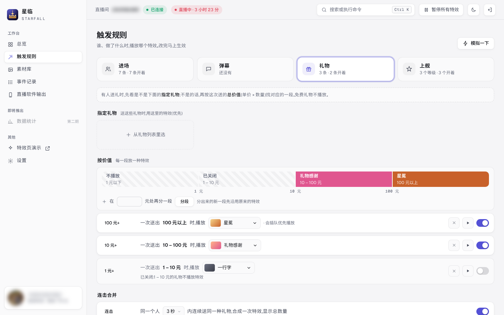
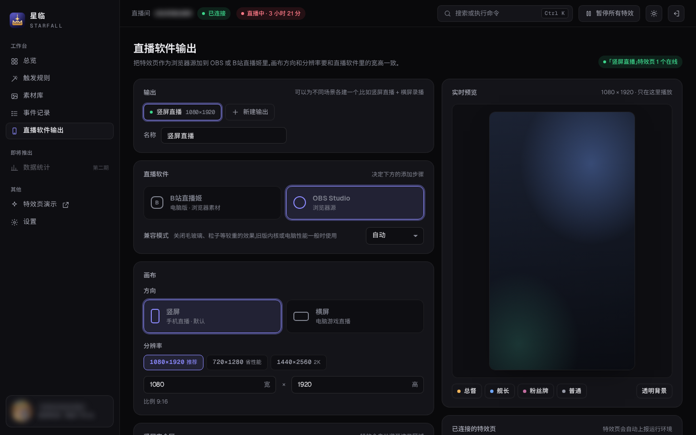
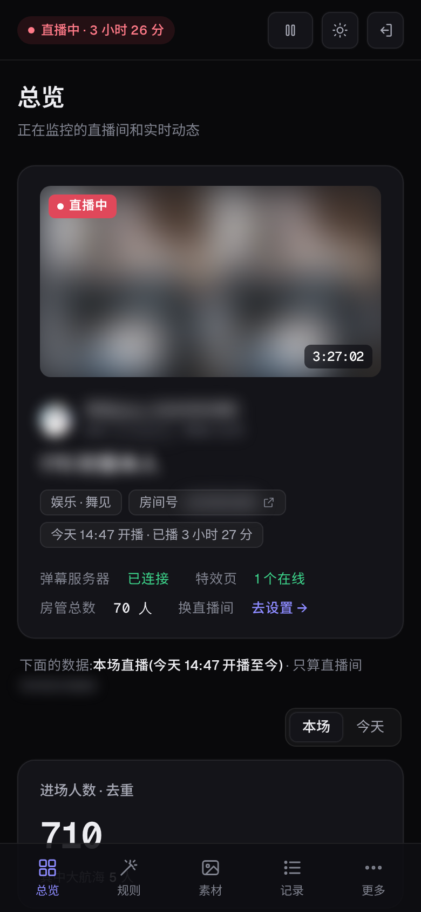
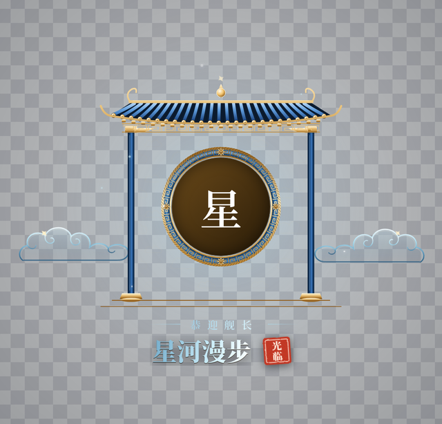
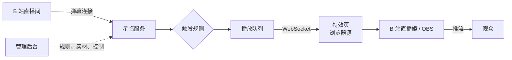

<div align="center">


# 星临 Starfall

**B 站直播间互动特效系统**

观众进场、发弹幕、送礼物、上舰时，按你设定的规则，在直播画面上播放专属的动画、欢迎语和音效。

[](CHANGELOG.md)
[](LICENSE)
[](https://nodejs.org/)
[](#使用指南)

</div>

<p align="center">
  
</p>

<p align="center"><sub>截图中的账号、主播、房间号、直播标题和观众信息均已做模糊处理。</sub></p>

---

## 目录

- [简介](#简介)
- [功能特性](#功能特性)
- [界面预览](#界面预览)
- [工作原理](#工作原理)
- [快速开始](#快速开始)
- [配置](#配置)
- [使用指南](#使用指南)
- [数据、备份与安全](#数据备份与安全)
- [开发](#开发)
- [路线图](#路线图)
- [声明](#声明)
- [开源协议](#开源协议)

---

## 简介

星临是一套部署在服务器上的直播特效系统，由三部分组成：

| 组成 | 作用 |
|---|---|
| **星临服务** | 连接 B 站直播间，实时接收进场、弹幕、礼物、上舰消息，按规则决定播放什么 |
| **特效页** | 作为浏览器源放进 B 站直播姬或 OBS，在直播画面上播放特效 |
| **管理后台** | 在浏览器里设置规则、管理素材、查看实时动态和播放队列，电脑和手机都能用 |

星临面向以竖屏直播为主的主播，默认画布为 1080×1920，并自动避开 B 站 App 的顶部信息栏和底部弹幕区；同时支持横屏画布。

## 功能特性

### 触发规则

- **进场**：按身份区分——专属用户 → 大航海（总督 / 提督 / 舰长）→ 房管 → 粉丝牌（按等级分段）→ 其他观众，使用第一条符合的规则；可设置同一观众多久内不重复，或每场直播只播一次。
- **弹幕**：关键词触发（包含 / 完全一致），可限定发送人（所有人、本房间粉丝牌、大航海、房管），分别设置全场与每人的冷却时间。
- **礼物**：指定礼物优先匹配（按礼物编号区分同名礼物），其余按单次总价值分段；免费礼物不触发；连击自动合并为一次，并显示总数量。
- **上舰**：开通与续费可共用或分别设置特效；同一次上舰只播放一次；欢迎语可显示「上舰 / 续费」与月数。

### 播放控制

- 统一播放队列，优先级为 **上舰 → 礼物 → 进场 → 弹幕**；上舰和 100 元以上的礼物可插队。
- 队列上限可调，可跳过当前、移出单条或清空；**紧急暂停**（`Ctrl + Shift + P`）立即停止所有特效。
- 黑名单；主播本人与连接用的账号不触发；未开播时默认不播放，也可开启排练模式。

### 特效与素材

- 内置素材开箱即用，包括大航海东方宫廷系列「门楼 · 亭阁 · 金銮」。
- 支持上传透明 WebM、MP4、PNG / GIF / WebP、SVGA、Lottie，并可搭配音效；自动检测视频的透明通道与时长。
- 欢迎语支持变量（昵称、身份、粉丝牌、礼物、数量、价值、月数等），可按事件分别撰写。
- 支持多个输出（例如竖屏直播与横屏录播各一份地址），附带兼容性自检页、声音测试页和演示页。

### 管理后台

- **总览**：正在监控的直播间（封面、主播、标题、分区、开播时间与时长）；本场 / 今天的进场人数、触发次数与身份构成；B 站看过人数、高能榜、点赞与粉丝数；实时动态与播放队列。
- **触发规则**：每条规则以一句话呈现，冷却时间点选即可；粉丝牌等级条、礼物价值刻度条一目了然；预览小窗使用真实特效页播放；「模拟一下」可验证会命中哪条规则。
- **事件记录**：每个事件命中了哪条规则、是否播放、未播放的原因。
- 新手引导、命令面板（`Ctrl + K`）、亮色 / 暗色主题、手机布局；配置导出 / 导入，每日自动备份。
- 数据按直播间分别统计，切换直播间后自动显示对应的数据。

## 界面预览

<table>
  <tr>
    <td width="50%"><br><sub><b>触发规则 · 进场</b>：每条规则一句话，匹配顺序清晰可见</sub></td>
    <td width="50%"><br><sub><b>触发规则 · 礼物</b>：指定礼物与价值刻度条</sub></td>
  </tr>
  <tr>
    <td width="50%"><br><sub><b>亮色主题</b>：默认跟随系统，可手动切换</sub></td>
    <td width="50%"><br><sub><b>直播软件输出</b>：画布方向、分辨率、安全区与实时预览</sub></td>
  </tr>
  <tr>
    <td width="50%"><br><sub><b>登录页</b></sub></td>
    <td width="50%" align="center"><br><sub><b>手机布局</b>：直播中随时暂停特效、调整规则</sub></td>
  </tr>
</table>

<p align="center">
  
  
  
  <br>
  <sub>大航海进场特效：舰长 · 门楼（4 秒）、提督 · 亭阁（6 秒）、总督 · 金銮（8 秒）</sub>
</p>

## 工作原理



1. 星临服务使用一个 B 站账号（建议使用小号）连接直播间，接收进场、弹幕、礼物、上舰等消息；默认只在开播时连接。
2. 每个事件按规则判断是否播放、播放哪个特效，并记录结果；需要播放的进入统一的播放队列。
3. 特效页作为浏览器源置于直播软件的最上层，由服务端统一调度，逐个播放动画与音效。

## 快速开始

### 环境要求

| 项目 | 要求 |
|---|---|
| 操作系统 | Linux 服务器（已在 Debian 12 上验证） |
| Node.js | 24 或更高 |
| pnpm | 通过 Corepack 启用，版本由 `package.json` 指定 |
| ffmpeg | 推荐安装，用于检测上传视频的透明通道和时长 |
| 内存 | 512 MB 以上 |
| 网络 | 能访问 B 站；开放一个端口供直播软件和浏览器访问（默认 17520） |

### 安装与启动

```bash
git clone https://github.com/chrismaxluo/starfall.git /opt/starfall
cd /opt/starfall
corepack enable
pnpm install
pnpm build                       # 构建管理后台和特效页
pnpm --filter @starfall/server start
```

首次启动会生成管理后台的初始密码，显示在日志中，同时写入 `data/initial-password.txt`。登录后请在「设置」中修改密码，修改后该文件会自动删除。

在浏览器中打开 `http://<服务器地址>:17520/`，登录后按新手引导完成设置。

### 作为系统服务运行

仓库提供了 systemd 服务文件，支持开机自启和崩溃后自动重启：

```bash
cp deploy/starfall.service /etc/systemd/system/
systemctl daemon-reload
systemctl enable --now starfall
journalctl -u starfall -f        # 查看日志
```

如果安装目录不是 `/opt/starfall`，请先修改服务文件中的 `WorkingDirectory` 与 `STARFALL_DATA`。

### 更新

```bash
cd /opt/starfall
git pull
pnpm install
pnpm build
systemctl restart starfall
```

只修改了管理后台页面时，构建后即可生效，无需重启服务；服务端有改动时需要重启，重启期间特效会中断数秒，特效页会自动重新连接。

## 配置

所有配置均通过环境变量设置：

| 环境变量 | 默认值 | 说明 |
|---|---|---|
| `STARFALL_PORT` | `17520` | 服务端口 |
| `STARFALL_HOST` | `0.0.0.0` | 监听地址 |
| `STARFALL_DATA` | `./data` | 数据目录：数据库、素材文件、加密密钥、备份 |
| `STARFALL_TZ` | `Asia/Shanghai` | 主播所在时区，用于「今天」的统计和专属用户的有效期 |

其余设置（连接时机、未开播时的处理、排队上限、黑名单、事件保留天数、自动备份等）都在管理后台的「设置」中完成。

## 使用指南

1. **登录 B 站账号**：在「设置」中用 B 站 App 扫码登录。星临只用它读取直播间消息，不会发送弹幕，建议使用小号。
2. **设置直播间**：填写房间号（短号或长号均可）。
3. **接入直播软件**：在「直播软件输出」中选择 B 站直播姬或 OBS，复制特效页地址，添加为浏览器源，宽高与画布保持一致（竖屏默认 1080×1920）。可以先打开自检页和声音测试页确认环境。
4. **设置触发规则**：在「触发规则」中为进场、弹幕、礼物、上舰分别选择特效，点 ▶ 预览效果，或用「模拟一下」验证规则。
5. **上传自己的素材**（可选）：在「素材库」上传动画和音效，推荐使用带透明通道的 WebM。
6. **直播中**：在总览中查看实时动态和播放队列；出现意外时按 `Ctrl + Shift + P` 暂停所有特效。

## 数据、备份与安全

- **数据位置**：所有运行数据保存在 `STARFALL_DATA` 目录，包括 SQLite 数据库、素材文件、加密密钥和备份，不会写入代码目录。
- **备份**：默认每天自动备份数据库和配置，保留 7 天；也可以在「设置」中随时导出配置（可包含素材文件），在另一台机器上导入。
- **登录信息**：B 站登录信息使用本机生成的密钥加密保存；默认只在开播时连接直播间。
- **特效页地址**：地址中带有密钥，请勿公开；泄露后可在「直播软件输出」中重置。
- **后台密码**：忘记密码时，在服务器上运行 `pnpm reset-password` 生成新密码。
- **公网访问**：如需通过公网访问管理后台，建议在前面配置 HTTPS 反向代理。

## 开发

```bash
pnpm install
pnpm dev             # 启动服务（端口 17520，修改代码后自动重启）
pnpm check           # 类型检查 + 代码检查 + 测试
pnpm build           # 构建管理后台和特效页
```

### 技术栈

| 部分 | 技术 |
|---|---|
| 语言与结构 | TypeScript，pnpm monorepo；服务端由 Node.js 24 直接运行 TypeScript |
| 服务端 | Fastify、WebSocket、SQLite（better-sqlite3 + Drizzle ORM）、Zod、protobufjs |
| 管理后台 | Vue 3、Vite |
| 特效页 | TypeScript、Vite；CSS / SVG 动画，lottie-web、svgaplayerweb |
| 测试 | Vitest |

### 目录结构

```
apps/server/        星临服务：接口、实时连接、规则判断、播放队列
apps/admin/         管理后台
apps/overlay/       特效页（浏览器源）
packages/shared/    公共定义：类型、常量、消息格式
packages/core/      纯逻辑：规则匹配、冷却、合并、播放队列
packages/bili/      B 站协议：登录、直播间接口、弹幕连接、消息解析
deploy/             systemd 服务文件
design/             品牌资源与设计预览
docs/               需求、方案设计、协议笔记、开发约定
fixtures/           测试样本（已脱敏）
```

### 文档

| 文档 | 内容 |
|---|---|
| [需求文档](docs/requirements.md) | 功能需求与验收场景 |
| [方案设计](docs/architecture.md) | 技术选型、架构、数据模型、接口 |
| [B 站协议笔记](docs/bili-protocol.md) | 直播消息格式与字段说明 |
| [开发约定](docs/development.md) | 分支、提交、标签与回退 |
| [更新记录](CHANGELOG.md) | 各版本的变化 |

## 路线图

- [x] v1.0.0：进场、弹幕、礼物、上舰特效，完整的管理后台，服务器部署
- [ ] 特效全面换为东方宫廷风格（礼物、粉丝牌、房管、弹幕回应等）
- [ ] Windows 客户端：在主播电脑上直接运行，界面与服务器版一致
- [ ] 第二期：醒目留言、关注、点赞触发，礼物与直播数据统计，观众档案

## 声明

星临是**非官方**的第三方工具，与哔哩哔哩（bilibili）没有任何关联。它通过 B 站网页端的直播消息接口读取直播间事件，接口可能随时变化。请遵守 B 站用户协议，建议使用小号登录，由此产生的账号风险由使用者自行承担。

B 站的官方图标、礼物图片等素材版权归哔哩哔哩所有，本项目不内置这些素材，仅在运行时从 B 站加载。

## 开源协议

[GPL-3.0](LICENSE) © 2026 chrismaxluo

你可以自由使用、修改和再发布本项目；基于本项目修改后发布的作品，也必须以 GPL-3.0 协议开源。

字体：[Geist](https://github.com/vercel/geist-font)、[Noto Sans SC](https://github.com/notofonts/noto-cjk)、[Noto Serif SC](https://github.com/notofonts/noto-cjk)（均为 SIL Open Font License 1.1）。
