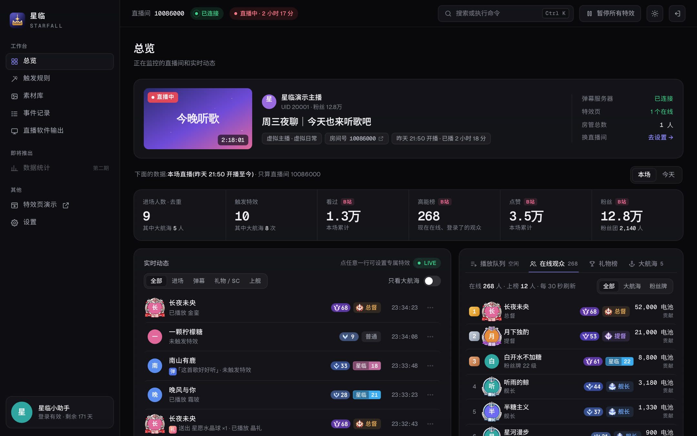
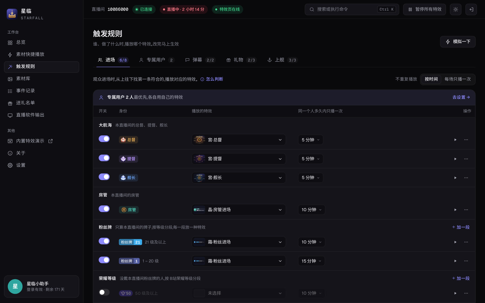
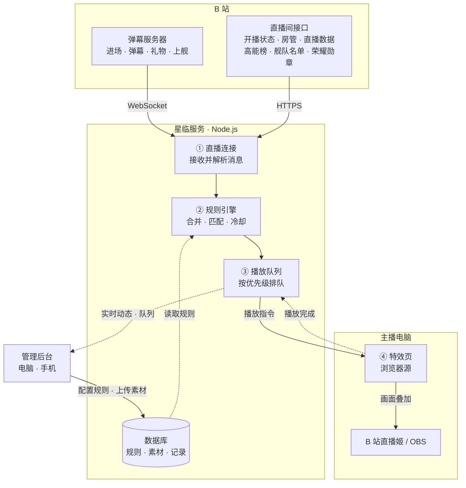
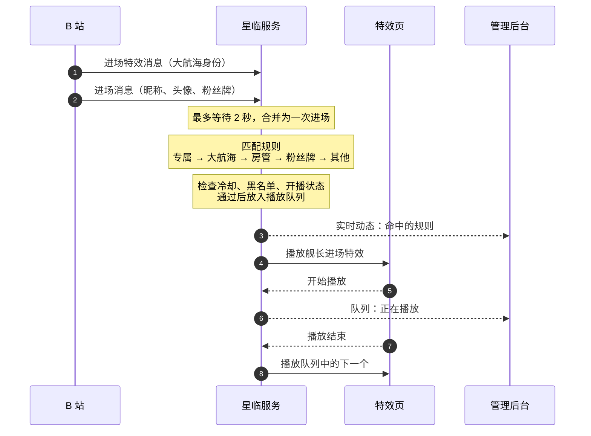
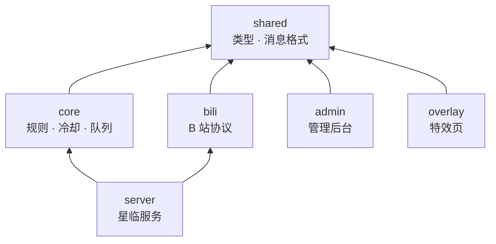

<div align="center">


# 星临 Starfall

**B 站直播间互动特效系统**

识别每一位进场的观众，在弹幕、礼物、上舰的时刻，于直播画面上播放专属的动画、欢迎语与音效。

[](CHANGELOG.md)
[](LICENSE)
[](https://nodejs.org/)
[](https://www.typescriptlang.org/)
[](#质量保障)

[界面预览](#界面预览) · [系统架构](#系统架构) · [快速开始](#快速开始) · [部署指南](docs/deployment.md) · [使用手册](docs/user-guide.md) · [更新记录](CHANGELOG.md)

</div>

<br>

## 简介

星临是一套自托管的直播特效系统。服务端连接 B 站直播间，实时识别观众身份与互动事件，按主播设定的规则调度特效；特效页以浏览器源的形式嵌入 B 站直播姬或 OBS，在直播画面上呈现。主播通过网页后台完成全部配置，电脑与手机均可操作。

<table>
  <tr>
    <td width="33%" valign="top"><b>身份识别</b><br><sub>区分主播、总督、提督、舰长、房管、粉丝牌等级、荣耀等级与指定观众，各有专属特效；头像套上 B 站的大航海头像框</sub></td>
    <td width="33%" valign="top"><b>四类触发</b><br><sub>进场、弹幕关键词（可按身份多选谁发的才算）、礼物（指定礼物 / 价值分段）、开通与续费大航海</sub></td>
    <td width="33%" valign="top"><b>统一调度</b><br><sub>按优先级排队播放，高价值事件插队，冷却、合并、去重，一键紧急暂停</sub></td>
  </tr>
  <tr>
    <td width="33%" valign="top"><b>特效素材</b><br><sub>内置大航海东方宫廷特效和玻璃质感特效，支持上传透明 WebM、MP4、图片、SVGA、Lottie，可搭配音效；SVGA 里的头像、昵称、头像框等图层自动换成进场的观众；位置、大小、边缘羽化随意调</sub></td>
    <td width="33%" valign="top"><b>直播软件</b><br><sub>兼容 B 站直播姬与 OBS，竖屏优先并自动避开安全区，支持多路输出；另有弹幕列表，把所有人的弹幕排成一列显示在画面边上；升级后自动更新</sub></td>
    <td width="33%" valign="top"><b>管理后台</b><br><sub>实时动态、播放队列、在线观众、礼物榜（含上舰与醒目留言）、大航海到场、事件记录、模拟验证、备份与导入导出</sub></td>
  </tr>
</table>

## 界面预览


<sub><b>总览</b>：直播间状态、本场数据、实时动态；右侧可以切换播放队列、在线观众、礼物榜、大航海。亮色 / 暗色跟随系统，可随时切换</sub>


<sub><b>触发规则</b>：每条规则一句话，按身份依次匹配</sub>

<sub>截图用的是演示数据，直播间、主播和观众都是编的。</sub>

## 系统架构



| 组件 | 职责 |
|---|---|
| **① 直播连接** | 使用 B 站账号连接直播间弹幕服务器（默认仅在开播时连接），断线自动重连；解析进场、弹幕、礼物、上舰、醒目留言及直播间实时数据 |
| **② 规则引擎** | 合并同一次进场的多条消息、礼物连击与上舰去重；按身份与规则匹配特效，检查冷却、黑名单与开播状态 |
| **③ 播放队列** | 全局单队列，优先级为上舰 → 礼物 → 进场 → 弹幕，高价值事件插队；由服务端统一调度，多个特效页保持同步 |
| **④ 特效页** | 运行在直播软件的浏览器源中，接收播放指令并渲染 CSS / SVG 动画、视频、SVGA、Lottie 与音效 |
| **管理后台** | 配置规则与素材，查看实时动态、播放队列与直播数据，模拟事件验证规则 |

### 事件处理流程

以一位舰长进入直播间为例：



## 技术栈

| 层级 | 技术 | 选择理由 |
|---|---|---|
| 运行环境 | Node.js 24 · TypeScript 6 · pnpm workspace | Node.js 直接运行 TypeScript 源码，服务端无需编译；多个包共享类型定义 |
| 服务端 | Fastify 5 · @fastify/websocket | 轻量高效，REST 接口与实时推送共用一个端口 |
| 数据 | SQLite（better-sqlite3 + Drizzle ORM）· Zod 4 | 单文件数据库，无需额外服务，备份即复制；接口参数与配置文件统一校验 |
| 协议 | protobufjs 8 · ws | B 站的进场、礼物等消息已改为 protobuf 编码 |
| 管理后台 | Vue 3.5 · Vite 8 | 构建为静态文件，由服务端直接提供，电脑与手机共用一套界面 |
| 特效页 | CSS / SVG 动画 · lottie-web · svgaplayerweb | B 站直播姬与 OBS 的浏览器源均可流畅渲染，兼容常见特效素材格式 |
| 质量保障 | Vitest · ESLint · vue-tsc | 单元、集成与端到端测试，类型与代码检查一条命令完成 |
| 部署 | systemd · 可选 HTTPS 反向代理 | 开机自启、崩溃自动重启，内存占用受限 |

## 项目结构

```
starfall/
├── apps/
│   ├── server/        星临服务：REST 接口、实时推送、直播连接、播放调度
│   ├── admin/         管理后台（Vue 3）
│   └── overlay/       特效页（浏览器源）
├── packages/
│   ├── shared/        公共定义：类型、常量、消息格式
│   ├── core/          纯逻辑：规则匹配、冷却、合并、播放队列
│   └── bili/          B 站协议：登录、直播间接口、弹幕连接、消息解析
├── deploy/            systemd 服务文件
├── design/            品牌资源与设计预览
├── docs/              文档
└── fixtures/          测试样本（已脱敏）
```

各个包之间的依赖关系：



`core` 不接触网络、数据库与文件，所有规则判断都可以脱离直播环境单独测试；`bili` 只负责和 B 站通信，协议变化时改动集中在这一处。

## 设计要点

- **进场消息合并**：B 站的一次进场会拆成两条消息先后到达，间隔 0～1.5 秒，且只有后一条带粉丝牌。服务端最多等待 2 秒将两者合并，既不重复播放，也不丢失身份信息。
- **仅在开播时连接**：默认只在直播间开播期间连接弹幕服务器，下播自动断开，降低登录账号的风险。
- **服务端统一调度**：播放队列由服务端维护，多个特效页（例如同时接入直播姬与 OBS）画面保持同步；上舰与大额礼物插队，队列满时优先丢弃低优先级的事件。
- **规则可验证**：后台可以模拟任意进场、弹幕、礼物与上舰事件，未开播时也能查看命中了哪条规则以及原因。
- **账号信息加密**：B 站登录凭据加密后存入数据库，密钥单独保存在数据目录。
- **端到端测试**：测试中启动一个模拟的 B 站弹幕服务器，完整走通连接、解析、匹配、排队到推送特效页的流程。

## 开发

```bash
pnpm install
pnpm dev          # 启动服务（端口 17520，修改后自动重启）
pnpm check        # 类型检查 + 代码检查 + 测试
pnpm build        # 构建管理后台与特效页
```

### 质量保障

- **测试**：360 余个单元与集成测试，覆盖消息解析、规则匹配、冷却与合并、播放队列、接口，以及基于模拟 B 站服务器的端到端流程。
- **检查**：TypeScript 严格模式、ESLint、Vue 模板类型检查，`pnpm check` 一次完成。
- **分支**：`main` 仅承载里程碑版本并打标签，日常开发在 `dev`；详见[开发约定](docs/development.md)。

## 快速开始

**环境要求**：一台 Linux 服务器（已在 Debian 12 验证）、Node.js 24+、可访问 B 站；推荐安装 ffmpeg，用于检测上传视频的透明通道与时长。

```bash
git clone https://github.com/chrismaxluo/starfall.git /opt/starfall
cd /opt/starfall
corepack enable && pnpm install
pnpm build
pnpm --filter @starfall/server start
```

启动后访问 `http://<服务器地址>:17520/`，使用日志中显示的初始密码登录（同时保存在 `data/initial-password.txt`），按新手引导完成：

1. 扫码登录 B 站账号（仅用于读取直播间消息，建议使用小号）
2. 填写直播间房间号
3. 将特效页地址添加为直播软件的浏览器源

端口、数据目录、时区可通过环境变量修改，其余设置都在管理后台「设置」中调整。作为系统服务运行、更新、HTTPS 与备份恢复，请参阅 **[部署指南](docs/deployment.md)**；规则配置与直播中的操作，请参阅 **[使用手册](docs/user-guide.md)**。

## 文档

| 文档 | 内容 |
|---|---|
| [部署指南](docs/deployment.md) | 安装、系统服务、更新、HTTPS、备份与恢复、常见问题 |
| [使用手册](docs/user-guide.md) | 首次设置、接入直播软件、配置规则、直播中的操作 |
| [需求文档](docs/requirements.md) | 功能需求与验收场景 |
| [方案设计](docs/architecture.md) | 技术选型、架构、数据模型、接口 |
| [B 站协议笔记](docs/bili-protocol.md) | 直播消息格式与字段说明 |
| [开发约定](docs/development.md) | 分支、提交、标签与回退 |
| [更新记录](CHANGELOG.md) | 各版本的变化（每个版本也在 [Releases](https://github.com/chrismaxluo/starfall/releases) 里） |

## 路线图

- [x] **v1.0.0**：进场、弹幕、礼物、上舰特效，完整的管理后台，服务器部署
- [x] 特效升级：大航海用东方宫廷风格（门楼 / 亭阁 / 金銮）；礼物、房管、弹幕回应用玻璃质感（晶礼 / 晶耀 / 晶巡 / 晶语）
- [x] **v1.1.0**：素材位置、大小、上下羽化、渐入渐出可调；素材库卡片操作；特效页自动更新、后台新版本提示
- [x] **v1.2.0**：大航海头像框、荣耀等级；弹幕规则按身份多选；SVGA 动态图层；总览切换面板（在线观众、礼物榜、大航海）；记录醒目留言
- [x] **v1.3.0**：弹幕列表（所有人的弹幕排成一列显示在直播画面上）；直播软件输出页改版
- [x] **v1.4.0**：管理后台体验全面改进（运行状态提醒、真实画面预览、撤销、事件原因与处理入口、备份恢复）；弹幕列表条数设置与自动消失
- [ ] Windows 客户端：在主播电脑上直接运行，界面与服务器版一致
- [ ] 第二期：醒目留言、关注、点赞触发；直播数据统计；观众档案

## 声明

星临是**非官方**的第三方工具，与哔哩哔哩（bilibili）无任何关联。本项目通过 B 站网页端的直播消息接口读取直播间事件，接口可能随时变化。使用时请遵守 B 站用户协议，建议使用小号登录，由此产生的账号风险由使用者自行承担。

B 站的官方图标、大航海头像框、荣耀等级勋章、礼物图片等素材版权归哔哩哔哩所有，本项目不内置这些素材，仅在运行时从 B 站加载。

## 开源协议

本项目基于 [GPL-3.0](LICENSE) 协议开源，© 2026 chrismaxluo。

你可以自由使用、修改和再发布本项目；基于本项目修改后发布的作品，也必须以 GPL-3.0 协议开源。

字体：[Geist](https://github.com/vercel/geist-font)、[Noto Sans SC](https://github.com/notofonts/noto-cjk)、[Noto Serif SC](https://github.com/notofonts/noto-cjk)（均为 SIL Open Font License 1.1）。
