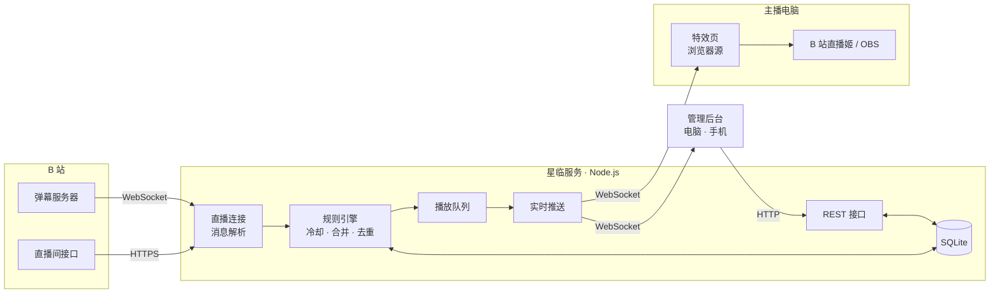
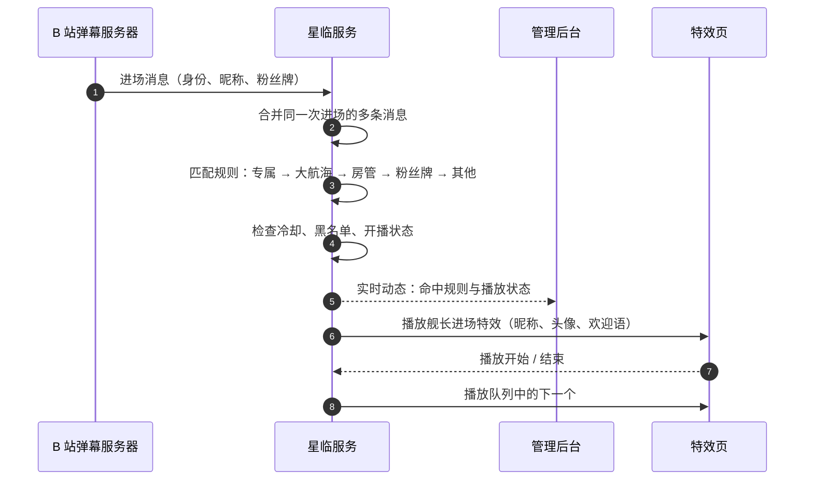

<div align="center">


# 星临 Starfall

**B 站直播间互动特效系统**

识别每一位进场的观众，在弹幕、礼物、上舰的时刻，于直播画面上播放专属的动画、欢迎语与音效。

[](CHANGELOG.md)
[](LICENSE)
[](https://nodejs.org/)
[](https://www.typescriptlang.org/)
[](#质量保障)

[界面预览](#界面预览) · [快速开始](#快速开始) · [部署指南](docs/deployment.md) · [使用手册](docs/user-guide.md) · [更新记录](CHANGELOG.md)

</div>

<br>

## 简介

星临是一套自托管的直播特效系统。服务端连接 B 站直播间，实时识别观众身份与互动事件，按主播设定的规则调度特效；特效页以浏览器源的形式嵌入 B 站直播姬或 OBS，在直播画面上呈现。主播通过网页后台完成全部配置，电脑与手机均可操作。

<table>
  <tr>
    <td width="33%" valign="top"><b>身份识别</b><br><sub>区分总督、提督、舰长、房管、粉丝牌等级与指定观众，各有专属特效</sub></td>
    <td width="33%" valign="top"><b>四类触发</b><br><sub>进场、弹幕关键词、礼物（指定礼物 / 价值分段）、开通与续费大航海</sub></td>
    <td width="33%" valign="top"><b>统一调度</b><br><sub>按优先级排队播放，高价值事件插队，冷却、合并、去重，一键紧急暂停</sub></td>
  </tr>
  <tr>
    <td width="33%" valign="top"><b>特效素材</b><br><sub>内置多款动画特效，支持上传透明 WebM、MP4、图片、SVGA、Lottie，可搭配音效</sub></td>
    <td width="33%" valign="top"><b>直播软件</b><br><sub>兼容 B 站直播姬与 OBS，竖屏优先并自动避开安全区，支持多路输出</sub></td>
    <td width="33%" valign="top"><b>管理后台</b><br><sub>实时动态、播放队列、直播数据、事件记录、模拟验证、备份与导入导出</sub></td>
  </tr>
</table>

## 界面预览

<table>
  <tr>
    <td width="50%"><br><sub><b>总览 · 暗色</b>：直播间状态、本场数据、实时动态与播放队列</sub></td>
    <td width="50%"><br><sub><b>总览 · 亮色</b>：默认跟随系统，可随时切换</sub></td>
  </tr>
  <tr>
    <td width="50%"><br><sub><b>触发规则</b>：每条规则一句话，按身份依次匹配</sub></td>
    <td width="50%"><br><sub><b>登录页</b></sub></td>
  </tr>
</table>

## 快速开始

**环境要求**：Linux 服务器（已在 Debian 12 验证）、Node.js 24+、可访问 B 站；推荐安装 ffmpeg，用于检测上传视频的透明通道与时长。

```bash
git clone https://github.com/chrismaxluo/starfall.git /opt/starfall
cd /opt/starfall
corepack enable && pnpm install
pnpm build
pnpm --filter @starfall/server start
```

启动后访问 `http://<服务器地址>:17520/`，使用日志中显示的初始密码登录（同时保存在 `data/initial-password.txt`），按新手引导完成：

1. 扫码登录 B 站账号（仅用于读取直播间消息，建议使用小号）
2. 填写直播间房间号
3. 将特效页地址添加为直播软件的浏览器源

作为系统服务运行、更新、HTTPS 与备份恢复，请参阅 **[部署指南](docs/deployment.md)**；规则配置与直播中的操作，请参阅 **[使用手册](docs/user-guide.md)**。

## 配置

| 环境变量 | 默认值 | 说明 |
|---|---|---|
| `STARFALL_PORT` | `17520` | 服务端口 |
| `STARFALL_HOST` | `0.0.0.0` | 监听地址 |
| `STARFALL_DATA` | `./data` | 数据目录：数据库、素材文件、加密密钥、备份 |
| `STARFALL_TZ` | `Asia/Shanghai` | 主播所在时区，用于「今天」的统计与专属用户有效期 |

连接时机、未开播时的处理、排队上限、黑名单、事件保留天数、自动备份等，均在管理后台「设置」中调整。

## 系统架构



| 组件 | 职责 |
|---|---|
| **直播连接** | 使用 B 站账号连接直播间弹幕服务器（默认仅在开播时连接），断线自动重连；解析进场、弹幕、礼物、上舰及直播间实时数据 |
| **规则引擎** | 合并同一次进场的多条消息、礼物连击与上舰去重；按身份与规则匹配特效，检查冷却、黑名单与开播状态 |
| **播放队列** | 全局单队列，优先级为上舰 → 礼物 → 进场 → 弹幕，高价值事件插队；由服务端统一调度，多个特效页保持同步 |
| **特效页** | 运行在直播软件的浏览器源中，接收播放指令并渲染 CSS / SVG 动画、视频、SVGA、Lottie 与音效 |
| **管理后台** | 配置规则与素材，查看实时动态、播放队列与直播数据，模拟事件验证规则 |

### 事件处理流程

以一位舰长进入直播间为例：



## 技术栈

| 层级 | 技术 |
|---|---|
| 运行环境 | Node.js 24 · TypeScript 6 · pnpm workspace（monorepo） |
| 服务端 | Fastify 5 · @fastify/websocket · SQLite（better-sqlite3 13 + Drizzle ORM）· Zod 4 · protobufjs 8 |
| 管理后台 | Vue 3.5 · Vite 8 |
| 特效页 | TypeScript · Vite 8 · CSS / SVG 动画 · lottie-web · svgaplayerweb |
| 质量保障 | Vitest · ESLint · vue-tsc 类型检查 |
| 部署 | systemd（开机自启、崩溃自动重启）· 可选 HTTPS 反向代理 |

服务端由 Node.js 直接运行 TypeScript 源码，无需编译；管理后台与特效页由 Vite 构建为静态文件，由服务端提供。

## 项目结构

```
starfall/
├── apps/
│   ├── server/        星临服务：REST 接口、实时推送、规则判断、播放队列
│   ├── admin/         管理后台（Vue 3）
│   └── overlay/       特效页（浏览器源）
├── packages/
│   ├── shared/        公共定义：类型、常量、消息格式
│   ├── core/          纯逻辑：规则匹配、冷却、合并、播放队列
│   └── bili/          B 站协议：登录、直播间接口、弹幕连接、消息解析
├── deploy/            systemd 服务文件
├── design/            品牌资源与设计预览
├── docs/              文档
└── fixtures/          测试样本（已脱敏）
```

## 开发

```bash
pnpm install
pnpm dev          # 启动服务（端口 17520，修改后自动重启）
pnpm check        # 类型检查 + 代码检查 + 测试
pnpm build        # 构建管理后台与特效页
```

### 质量保障

- **测试**：266 个单元与集成测试，覆盖消息解析、规则匹配、冷却与合并、播放队列、接口，以及基于模拟 B 站服务器的端到端流程。
- **检查**：TypeScript 严格模式、ESLint、Vue 模板类型检查，`pnpm check` 一次完成。
- **分支**：`main` 仅承载里程碑版本并打标签，日常开发在 `dev`；详见[开发约定](docs/development.md)。

## 文档

| 文档 | 内容 |
|---|---|
| [部署指南](docs/deployment.md) | 安装、系统服务、更新、HTTPS、备份与恢复、常见问题 |
| [使用手册](docs/user-guide.md) | 首次设置、接入直播软件、配置规则、直播中的操作 |
| [需求文档](docs/requirements.md) | 功能需求与验收场景 |
| [方案设计](docs/architecture.md) | 技术选型、架构、数据模型、接口 |
| [B 站协议笔记](docs/bili-protocol.md) | 直播消息格式与字段说明 |
| [开发约定](docs/development.md) | 分支、提交、标签与回退 |
| [更新记录](CHANGELOG.md) | 各版本的变化 |

## 路线图

- [x] **v1.0.0**：进场、弹幕、礼物、上舰特效，完整的管理后台，服务器部署
- [ ] 特效全面换为东方宫廷风格：礼物、粉丝牌、房管、弹幕回应
- [ ] Windows 客户端：在主播电脑上直接运行，界面与服务器版一致
- [ ] 第二期：醒目留言、关注、点赞触发；礼物与直播数据统计；观众档案

## 声明

星临是**非官方**的第三方工具，与哔哩哔哩（bilibili）无任何关联。本项目通过 B 站网页端的直播消息接口读取直播间事件，接口可能随时变化。使用时请遵守 B 站用户协议，建议使用小号登录，由此产生的账号风险由使用者自行承担。

B 站的官方图标、礼物图片等素材版权归哔哩哔哩所有，本项目不内置这些素材，仅在运行时从 B 站加载。

## 开源协议

本项目基于 [GPL-3.0](LICENSE) 协议开源，© 2026 chrismaxluo。

你可以自由使用、修改和再发布本项目；基于本项目修改后发布的作品，也必须以 GPL-3.0 协议开源。

字体：[Geist](https://github.com/vercel/geist-font)、[Noto Sans SC](https://github.com/notofonts/noto-cjk)、[Noto Serif SC](https://github.com/notofonts/noto-cjk)（均为 SIL Open Font License 1.1）。
