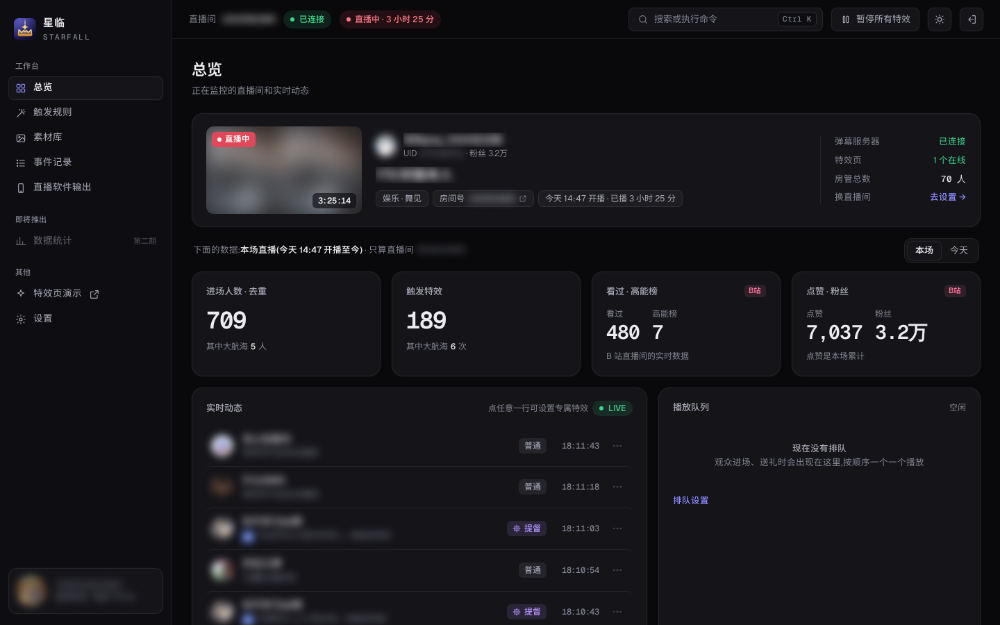
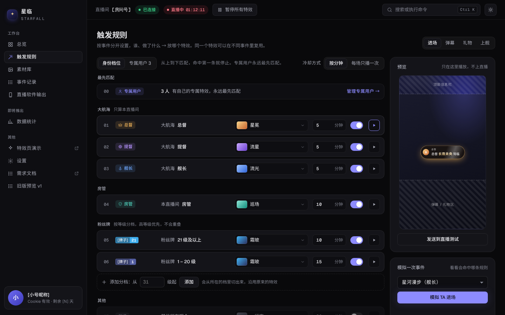
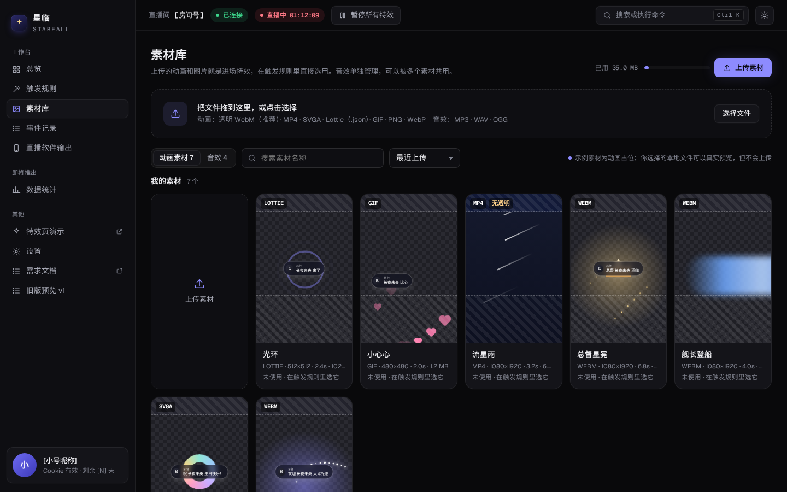
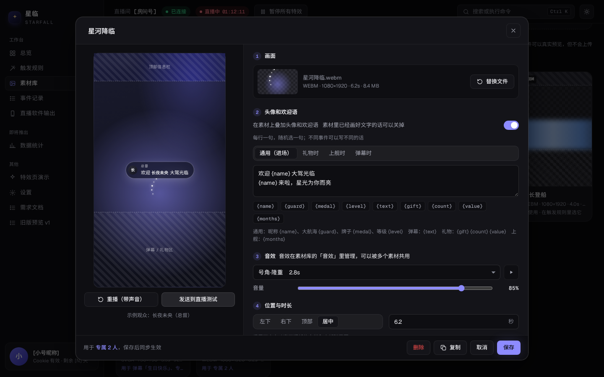
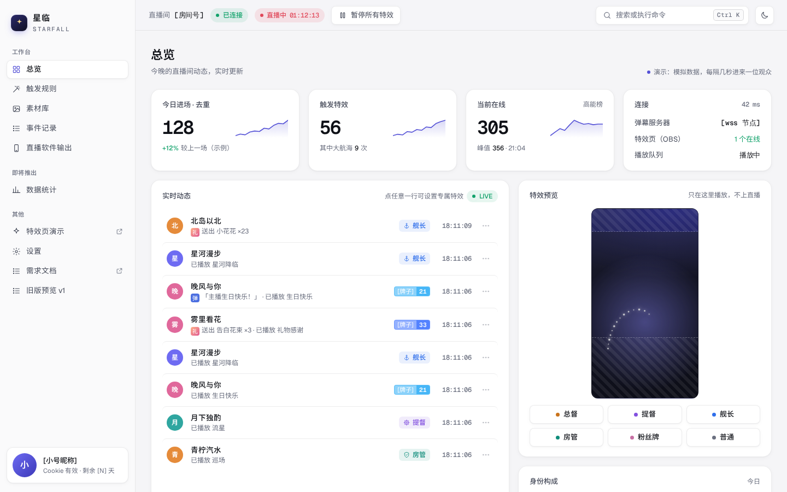
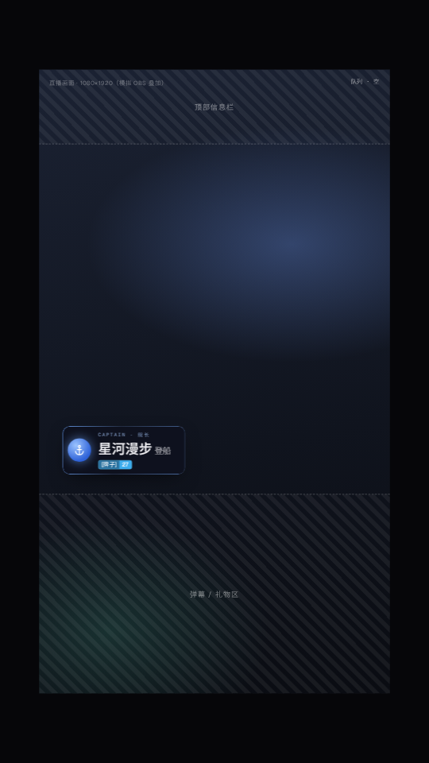
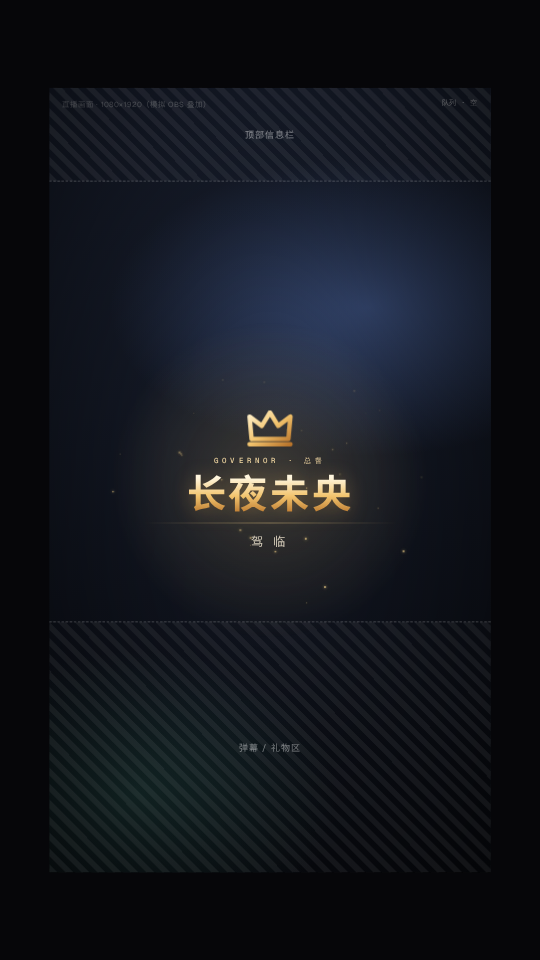
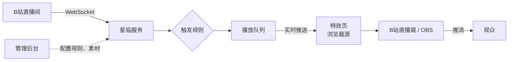

<div align="center">

# ✦ 星临 Starfall

**B 站直播间互动特效工具**

观众进场、发弹幕、送礼物、上舰时，按你的规则在直播画面上播放动画、欢迎语和音效。


</div>

<p align="center">
  
</p>

> **当前阶段**：需求已整理完成，界面设计预览已完成，正在进入方案设计与技术验证。**还没有可用的正式版本。**
> 下面的截图来自界面设计预览，数据为示例。

---

## 它能做什么

| 事件 | 可以这样设置 |
|---|---|
| **进场** | 总督、提督、舰长、房管、粉丝牌等级分档各放不同的素材；给指定的人设**专属素材**（可设有效期，比如生日当天）；支持"每场直播每人只播一次" |
| **弹幕** | 有人发"生日快乐"就放烟花；可限定发送人（比如只认粉丝牌 ≥ 10 级），带全局冷却和每人冷却，防刷屏 |
| **礼物** | 指定礼物对应指定素材；按单次价值（数量 × 单价）分档；连击自动合并，显示 ×N |
| **上舰** | 开通、续费分别设置，欢迎语里显示月数 |

- **上传即用**：把透明 WebM、GIF、PNG、SVGA、Lottie 拖进素材库，它就是一个可以直接选用的特效。
- **竖屏优先**：默认 1080×1920，自动避开 B站 App 的顶部信息栏和底部弹幕区。
- **直播姬和 OBS 都支持**：作为浏览器源放进直播软件即可，附带兼容性自检页和声音测试页。
- **直播时放心用**：一键暂停所有特效（`Ctrl + Shift + P`）、清空队列；未开播时默认不播；黑名单；每一次触发都有记录，能查到"为什么没播"。
- **手机也能管**：管理后台适配手机，直播中可以随时调整。

---

## 界面预览

<table>
  <tr>
    <td width="50%"><br><sub><b>触发规则</b>：按事件分标签，身份档位固定排序、分档不重叠；右侧可以模拟一次事件，看会命中哪条规则</sub></td>
    <td width="50%"><br><sub><b>素材库</b>：上传的文件就是素材，悬停预览；没有透明通道的文件会提醒</sub></td>
  </tr>
  <tr>
    <td width="50%"><br><sub><b>素材设置</b>：画面、欢迎语（可按事件分别写）、音效、位置与时长</sub></td>
    <td width="50%"><br><sub><b>亮色模式</b>：默认跟随系统，也可以手动切换</sub></td>
  </tr>
</table>

<p align="center">
  
  &nbsp;
  
  <br>
  <sub>竖屏特效页：舰长进场（左）、总督进场（右）。斜线区域是安全区，只在预览中显示</sub>
</p>

---

## 工作原理



1. 星临用一个 B 站**小号**连接你的直播间，实时接收进场、弹幕、礼物、上舰消息。
2. 按你设定的规则判断要不要播、播哪个素材，放进播放队列（上舰 > 礼物 > 进场 > 弹幕）。
3. 特效页作为**浏览器源**放在直播软件的最上层，收到指令后播放动画和音效。

先以网页服务的形式运行在服务器上；之后会封装成 **Windows 客户端**，界面完全一致，直接在主播电脑上运行。

---

## 开发进度

- [x] 需求整理（[需求文档](docs/requirements.md)）
- [x] 界面设计预览
- [x] OBS 兼容性与声音实测
- [ ] 方案设计（数据库、接口、模块）
- [ ] 技术验证（B 站协议抓包、B站直播姬实测、竖屏安全区校准）
- [ ] 第一期开发：进场、弹幕、礼物、上舰 + 素材库 + 管理后台
- [ ] 联调测试、部署上线、试用反馈
- [ ] Windows 客户端
- [ ] 第二期：SC / 关注 / 点赞触发、礼物统计、直播数据、观众档案

---

## 技术栈（规划）

| 部分 | 选型 |
|---|---|
| 语言与结构 | TypeScript，pnpm monorepo |
| 后端 | Node.js 24、Fastify、WebSocket、SQLite（better-sqlite3 + Drizzle） |
| 管理后台 | Vue 3、Vite、Pinia、Naive UI |
| 特效页 | Vite、GSAP、Lottie、PixiJS、透明 WebM，SVGA 可选 |
| Windows 版 | Electron + electron-builder |

---

## 目录结构

```
docs/               需求文档、README 截图
design/preview/     界面设计预览（纯静态网页，不是正式代码）
design/tools/       预览相关的小工具
```

## 本地查看设计预览

```bash
python3 design/tools/fetch_fonts.py                        # 首次：下载字体（约 5 MB）
python3 -m http.server 8080 --directory design/preview     # 然后打开 http://localhost:8080/
```

修改需求文档后，重新生成网页版：

```bash
python3 -m venv .venv && .venv/bin/pip install markdown
.venv/bin/python design/tools/md2html.py
```

---

## 声明

星临是**非官方**的第三方工具，与哔哩哔哩（bilibili）没有任何关联。它通过 B 站网页端公开的直播消息接口读取直播间事件，接口随时可能变化；使用时请遵守 B 站的用户协议，**建议使用小号登录**，由此产生的账号风险由使用者自行承担。

B 站的官方图标、礼物图片等素材版权归哔哩哔哩所有，本项目不内置这些素材，仅在运行时从 B 站加载。

## 开源协议

[GPL-3.0](LICENSE) © 2026 chrismaxluo

你可以自由使用、修改和再发布本项目；基于本项目修改后发布的作品，也必须以 GPL-3.0 开源。

设计预览中使用的字体：[Geist](https://github.com/vercel/geist-font)、[Noto Sans SC](https://github.com/notofonts/noto-cjk)（均为 SIL Open Font License 1.1）。
