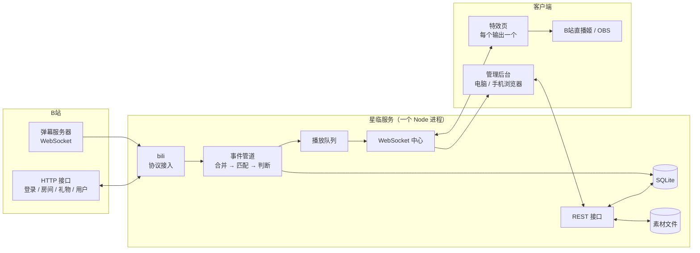
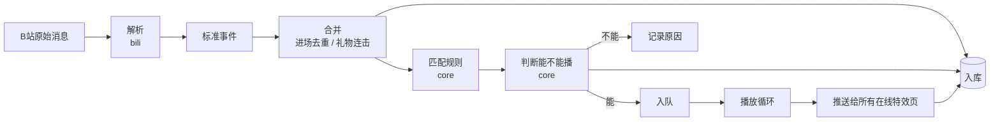

# 星临 Starfall · 方案设计

| 项目 | 内容 |
|---|---|
| 版本 | v1.1 |
| 日期 | 2026-09-25 |
| 状态 | **已确认**（2026-09-25）；v1.1 按 P0 实测结果更新 |
| 依据 | [需求文档 v1.0](requirements.md)（已确认） |

> 本文档回答"怎么做"：技术栈、架构、模块、数据、接口和协议。需求编号（如 F-EN-01）对应需求文档。
> P0 技术验证（2026-09-25）后已按实测结果更新，实测细节见 [B站协议笔记](bili-protocol.md)。仍标记 **【待验证】** 的内容（上舰、开播消息等）在 P1 / P2 中长期运行时确认。

---

## 1. 设计原则

1. **规则判断是纯逻辑**：匹配、冷却、队列不碰网络和数据库，全部可以单元测试。B 站协议再怎么变，只影响协议模块。
2. **服务端是唯一的判断者**：所有"放不放、放哪个、什么时候放"都在服务端决定；特效页只负责播放，管理后台只负责配置和展示。多个特效页看到的永远是同一个结果。
3. **事件先记录，再判断**：每个事件都入库，并记下判断结果和原因（F-DA-01、F-UI-04）。排查"为什么没播"时有据可查。
4. **一个进程，一个端口**：服务、管理后台、特效页在同一个 Node 进程、同一个端口里，部署简单；以后封装 Windows 版时直接内嵌。
5. **不依赖 Linux 专有能力**：路径、数据目录、外部程序都可配置，保证能在 Windows 上运行（N-06）。
6. **能自动降级的就不报错**：特效页不支持某个效果时降级播放；B 站接口出错时重试并提示，不让服务崩溃。

---

## 2. 技术栈

### 2.1 选型

版本为 2026-09-25 查询的最新稳定版；实际安装以 `pnpm-lock.yaml` 锁定的版本为准。

| 部分 | 选型 | 版本 | 选它的理由 | 考虑过的其他方案 |
|---|---|---|---|---|
| 运行环境 | Node.js | 24.x（服务器已装 24.21.0） | 长期支持版；Electron 内置的也是 Node，代码可以直接复用 | Bun、Deno：生态和 Electron 兼容性不如 Node |
| 语言 | TypeScript | **6.0** | 前后端统一，类型检查减少错误 | 7.0（Go 重写版）：**typescript-eslint 与 vue-tsc 尚不支持**（P1 搭建时确认），工具链跟上后再升级；纯 JavaScript：缺少类型不好维护 |
| 包管理 | pnpm（workspaces） | 12.x | 适合 monorepo，安装快、占空间小 | npm workspaces：依赖隔离较弱 |
| Web 服务 | Fastify | 5.12 | 性能好；插件完善（静态文件、上传、Cookie、限流、WebSocket）；自带 Pino 日志 | Express：较老，性能和类型支持较弱；NestJS：对这个规模太重 |
| 实时通信 | @fastify/websocket | 11.3 | 和 Fastify 集成；特效页和后台都需要服务端主动推送 | SSE：只能单向，特效页需要回报播放状态；Socket.IO：不需要它的额外功能 |
| 文件上传 | @fastify/multipart | 10.1 | 流式接收，大文件不占内存 | — |
| 数据库 | SQLite + better-sqlite3 | 13.0 | 单文件，不用另装数据库；同步 API，写起来简单；Windows 版可直接内嵌 | PostgreSQL：需要单独部署，对单用户工具过重；Node 自带的 node:sqlite：尚不稳定 |
| ORM / 迁移 | Drizzle ORM + drizzle-kit | 0.45 / 0.31 | 类型安全、轻量；自动生成数据库迁移 | Prisma：较重，有额外的引擎进程 |
| 数据校验 | Zod | 4.6 | 接口参数、配置、WebSocket 消息的校验；**同一份定义**生成 TS 类型，前后端共用 | — |
| protobuf | protobufjs | 8.8 | 解析 B 站新版 pb 格式消息：**进场 `INTERACT_WORD_V2`、送礼 `SEND_GIFT_V2`**（P0 已确认） | 手写解码：维护成本高 |
| 日志 | Pino | 10.3 | Fastify 自带；结构化日志，性能好 | — |
| 管理后台框架 | Vue 3 + Vite | 3.5 / 8.3 | 上手快、生态成熟 | React：同样可行，Vue 的表单和模板写法更贴合后台场景 |
| 状态管理 / 路由 | Pinia + Vue Router | 4.0 / 5.3 | Vue 官方方案 | — |
| UI 组件库 | Naive UI | 2.45 | 暗色主题完善，主题可深度定制，能还原设计预览的风格 | Element Plus：暗色和定制能力稍弱 |
| 特效动画 | GSAP | 3.15 | 时间轴编排精准，适合横幅、文字类特效 | 纯 CSS 动画：复杂编排难写 |
| Lottie | lottie-web | 5.13 | 播放 AE 导出的动画 | — |
| 粒子效果 | PixiJS | 8.21 | GPU 渲染，粒子多时也流畅 | Canvas 手写：工作量大 |
| SVGA | **svgaplayerweb**（复制到项目中固定版本） | 2.3.2 | P0 实测：按显示尺寸绘制，放大后清晰；解析快；不依赖 Worker 等新能力。已停止维护，用自己的接口包一层，便于以后更换 | svga（Lite）：按素材原始尺寸绘制后拉伸，铺满竖屏时明显模糊，且无法配置 |
| 二维码 | qrcode | 1.5 | 生成扫码登录的二维码 | — |
| 素材识别 | ffmpeg（ffprobe） | 5.1（Debian 官方源） | 准确读取时长、尺寸、**是否带透明通道** | 浏览器端读取：读不出 WebM 的透明通道 |
| 测试 | Vitest + Playwright | 5.0 / 1.63 | Vitest 测逻辑；Playwright 测后台和特效页的真实渲染（服务器上已装无头 Chromium） | Jest：和 Vite 配合不如 Vitest |
| 代码规范 | ESLint + Prettier | 最新版 | 统一格式，减少低级错误 | Biome：可行，但 Vue 支持尚不完整 |
| 运行守护 | PM2 | 7.0 | 崩溃重启、开机自启、日志切割 | systemd：也可以，PM2 在 Windows 上同样能用，调试更方便 |
| 运行 TS | **Node 24 原生**（去除类型） | — | 服务端和公共包直接由 Node 运行 `.ts`，**不需要编译**；开发时 `node --watch` 自动重启。限制：只能用可擦除的语法（不能用 enum、namespace），已在 `tsconfig` 中用 `erasableSyntaxOnly` 检查 | tsx：功能重复，已不需要 |
| Windows 版 | Electron + electron-builder | 44.x / 26.x | 桌面封装最成熟的方案 | Tauri：要用 Rust 重写服务端，成本高 |

### 2.2 版本策略

- 所有依赖由 `pnpm-lock.yaml` 锁定，保证每次安装的版本一致。
- **只在里程碑之间升级依赖**，升级单独提交，升级后跑一遍全部测试。
- Node.js 固定在 24.x（写在 `package.json` 的 `engines` 和 `.nvmrc` 中）。

### 2.3 需要新装的系统软件

| 软件 | 用途 | 安装方式 |
|---|---|---|
| pnpm 12 | 包管理 | Node 自带的 corepack 启用 |
| ffmpeg 5.1 | 读取素材信息 | ✅ 已安装（`apt install ffmpeg`） |
| Chromium（已装） | 自动化测试 | Playwright 已安装 |

Windows 版会内嵌 ffprobe 程序。ffmpeg 的 GPL 版本与本项目的 GPL-3.0 协议兼容。

---

## 3. 总体架构



**部署形态**：一个 Node 进程监听一个端口，同时提供：

| 路径 | 内容 |
|---|---|
| `/` | 管理后台（Vue 单页应用，构建后的静态文件） |
| `/overlay/<输出ID>?key=…` | 特效页（浏览器源地址） |
| `/api/*` | REST 接口 |
| `/ws/admin`、`/ws/overlay` | WebSocket |
| `/files/*` | 素材文件（支持断点续传和缓存） |

---

## 4. 代码结构

```
starfall/
├── packages/
│   ├── shared/     公共定义：Zod 模式、TS 类型、事件与消息格式、常量
│   ├── bili/       B站协议：WBI 签名、扫码登录、房间信息、WebSocket 客户端、消息解析
│   └── core/       纯逻辑：标准事件、规则匹配、冷却、播放队列、欢迎语变量替换
├── apps/
│   ├── server/     Fastify 服务：数据库、REST、WebSocket 中心、素材管理、定时任务
│   ├── admin/      管理后台（Vue 3 + Naive UI）
│   ├── overlay/    特效页（Vite + GSAP / Lottie / PixiJS / SVGA）
│   └── desktop/    Windows 客户端（Electron，最后做）
├── fixtures/       技术验证时抓到的 B 站真实消息样本（脱敏后），用于测试
├── docs/           文档
└── design/         设计预览
```

**依赖方向**（只能从上往下依赖，不能反过来）：

```
apps/server ──→ packages/core ──→ packages/shared
     └────────→ packages/bili ──→ packages/shared
apps/admin, apps/overlay ──→ packages/shared
```

- `core` 不依赖任何网络、数据库、文件，保证可以单独测试。
- `admin` 和 `overlay` 只依赖 `shared`，接口格式由同一份 Zod 定义约束，前后端不会对不上。

---

## 5. 事件处理流程

### 5.1 管道



每一步的输出都会带上结果，最终写进 `events` 表的一行：**事件内容 + 命中规则 + 播放状态 + 原因**。

### 5.2 标准事件

B 站各种消息解析后统一成下面的格式（定义在 `shared`），后面的步骤只认它，不关心原始消息长什么样：

```ts
interface Viewer {
  uid: number
  name: string
  face?: string               // 头像地址
  guard: 0 | 1 | 2 | 3        // 本直播间大航海：0 无，1 总督，2 提督，3 舰长
  isMod: boolean              // 本直播间房管：弹幕 info[2][2]；进场消息没有这个字段，按房管名单判断
  medal?: {                   // 只保留本直播间的粉丝牌
    name: string
    level: number
    colors: { bg: string; level: string; border: string; text: string }  // B 站下发的颜色
  }
  mystery: boolean            // 神秘人（弹幕 user.anon？）【待验证】
}

type StdEvent =
  | { kind: 'enter';  id: string; ts: number; viewer: Viewer }
  | { kind: 'danmu';  id: string; ts: number; viewer: Viewer; text: string }
  | { kind: 'gift';   id: string; ts: number; viewer: Viewer; giftId: number; giftName: string;
      unitPrice: number;     // 单价，单位：金瓜子（1 元 = 1000 金瓜子，已确认）
      count: number; paid: boolean; comboKey?: string }
  | { kind: 'guard';  id: string; ts: number; viewer: Viewer; level: 1 | 2 | 3; months: number;
      op: 'open' | 'renew' }  // 开通 / 续费的区分方式【待验证】
  | { kind: 'live';   id: string; ts: number; live: boolean }  // 开播 / 下播
```

金额一律用**整数（金瓜子）**存储和计算，只在显示时换算成元，避免小数误差。

### 5.3 合并

| 场景 | 做法 | 需求 |
|---|---|---|
| 舰长进场同时收到 `INTERACT_WORD` 和 `ENTRY_EFFECT` | 同一 UID 在 **3 秒**内的进场只保留一个，信息取两条消息的并集 | F-EN-10 |
| 礼物连击 | 同一 UID + 同一礼物在 **N 秒**（默认 3 秒，可设）内合并，数量累加；窗口结束或连击结束消息到达时才进入下一步 | F-GF-04 |
| 断线重连后的重复消息 | 按事件内容做短时间去重 | — |

### 5.4 匹配规则

| 事件 | 顺序（命中即停） | 需求 |
|---|---|---|
| 进场 | 专属用户（启用且未过期）→ 总督 → 提督 → 舰长 → 房管 → 粉丝牌分档（等级从高到低）→ 普通观众 | F-EN-01 ~ 08 |
| 弹幕 | 按列表顺序；需同时满足：规则启用、发送人条件、关键词（包含 / 完全一致） | F-DM-01 ~ 04 |
| 礼物 | 免费礼物直接跳过 → 指定礼物 → 按单次价值（数量 × 单价）分档，从高到低；低于最低档不播 | F-GF-01 ~ 03 |
| 上舰 | 按等级 + 开通 / 续费选素材 | F-GD-01 |

分档（粉丝牌、礼物价值）在数据库里只存**每档的起点**，区间由相邻两档自动推出，所以天然不会重叠（F-EN-04、F-GF-02）。

### 5.5 判断能不能播

按固定顺序检查，第一个不通过的就是记录下来的原因：

| 顺序 | 检查 | 不通过时的状态 |
|---|---|---|
| 1 | 是否在黑名单 | 黑名单 |
| 2 | 是否命中规则 | 未命中规则 |
| 3 | 是否暂停 | 已暂停 |
| 4 | 是否开播（或排练模式） | 未开播 |
| 5 | 冷却 | 冷却中 / 本场已播过 |
| 6 | 是否有在线的特效页 | 特效页不在线（F-OU-12，不积压） |
| — | 全部通过 | 进入队列 |

**冷却**的实现：

| 类型 | 键 | 存储 |
|---|---|---|
| 进场按分钟 | 规则 + UID | 内存中带过期时间的表 |
| 进场每场一次 | 直播场次 + UID | 内存集合；重启时从本场 `events` 记录中恢复 |
| 弹幕全局冷却 | 规则 | 内存 |
| 弹幕每人冷却 | 规则 + UID | 内存 |

服务重启后，按分钟的冷却会清空（最坏情况是重启后多播一次），可以接受。

### 5.6 播放队列

- **全局只有一个队列**，由服务端维护（F-PL-01）。每一项包含：素材快照、替换好变量的欢迎语、观众信息、优先级、入队时间、时长。
- 优先级：上舰 3 > 礼物 2 > 进场 1 > 弹幕 0（F-PL-02）。同优先级按先来后到。
- **插队**：开启时，上舰和单次 ≥ 100 元的礼物直接排到队首（F-PL-03）。
- **队列满**：超过上限（默认 10）时，丢弃优先级最低中最早进入的一项，该事件记录为"队列已满，丢弃"（F-PL-04）。
- **播放节奏由服务端控制**：推送 `play` 后按素材时长 + 0.3 秒间隔等待，再播下一项。特效页回报的 `started / ended` 只用于诊断，不影响节奏，这样多个特效页始终同步。
- **暂停**：立即向特效页发送 `stop`，清空队列；暂停期间的事件照常记录为"已暂停"（F-PL-05）。
- 播放时使用入队那一刻的**素材快照**，播放过程中修改素材不会造成画面错乱。

---

## 6. 数据模型

数据库文件：`<数据目录>/starfall.db`。时间统一存为毫秒时间戳；列表类配置存为 JSON 文本。

### 6.1 表一览

| 表 | 内容 | 需求 |
|---|---|---|
| `settings` | 键值配置：暂停状态、未开播策略、进场冷却方式、队列设置、连击窗口、保留期等 | F-PL、F-DA |
| `account` | B 站登录信息（**加密存储**）、UID、昵称、过期时间 | F-BL-01 ~ 02 |
| `room` | 房间号（长号、短号）、主播 UID 和昵称 | F-BL-03 |
| `assets` | 文件：类型、原始文件名、存储名、大小、尺寸、时长、是否透明、哈希 | F-AS-02 ~ 04 |
| `effects` | 素材（可播放的特效）：名称、是否内置、画面来源、是否叠加文字、分事件的欢迎语、音效、音量、位置、时长 | F-AS-05 ~ 15 |
| `rule_enter_tiers` | 进场身份档位（固定 5 行：总督、提督、舰长、房管、普通观众） | F-EN-01 ~ 05 |
| `rule_enter_bands` | 进场粉丝牌分档（起始等级唯一） | F-EN-04 |
| `rule_exclusive` | 专属用户（UID 唯一）、有效期 | F-EN-06 ~ 08 |
| `rule_danmu` | 弹幕规则（含排序） | F-DM |
| `rule_gift_specific` | 指定礼物（礼物 ID 唯一） | F-GF-01 |
| `rule_gift_bands` | 礼物价值分档（起始金额唯一，单位金瓜子） | F-GF-02 |
| `rule_guard` | 上舰（固定 3 行） | F-GD |
| `blacklist` | 黑名单 | F-PL-08 |
| `outputs` | 输出：直播软件、方向、宽高、安全区、缩放、边距、兼容模式、访问密钥 | F-OU |
| `live_sessions` | 直播场次：开始、结束时间 | F-EN-09 |
| `events` | 事件记录 | F-DA-01、F-UI-04 |
| `viewers` | 观众缓存：昵称、头像、最近身份（给专属用户、黑名单显示用） | — |
| `gifts` | 礼物配置缓存：ID、名称、单价、图标地址 | F-GF-05 |

### 6.2 关键表结构

**effects（素材）**

| 字段 | 类型 | 说明 |
|---|---|---|
| id | integer 主键 | |
| name | text 唯一 | F-AS-15 |
| builtin | boolean | 内置素材只读（F-AS-13） |
| visual_type | text | `builtin_style` 或 `asset` |
| visual_ref | text | 内置样式名，或 `assets.id` |
| show_text | boolean | 是否叠加头像和欢迎语（F-AS-08） |
| texts | json | `{ "enter": [...], "gift": [...], "guard": [...], "danmu": [...] }`；没写的事件用 `enter` |
| sound_asset_id | integer 可空 | 外键 → assets |
| volume | integer | 0 ~ 100 |
| position | text | `bl` / `br` / `top` / `center` |
| duration_ms | integer | |
| created_at / updated_at | integer | |

**events（事件记录）**

| 字段 | 类型 | 说明 |
|---|---|---|
| id | integer 主键 | |
| ts | integer | 事件时间 |
| session_id | integer 可空 | 所属直播场次 |
| kind | text | enter / danmu / gift / guard |
| uid、uname | integer / text | |
| viewer | json | 当时的身份快照（大航海、粉丝牌、房管） |
| payload | json | 弹幕内容、礼物和数量、上舰等级和月数 |
| rule | text 可空 | 命中的规则说明，例如"进场 · 舰长" |
| effect_id | integer 可空 | 播放的素材 |
| status | text | played / no_rule / paused / offline / cooldown / once / blacklist / no_overlay / dropped |
| raw | json 可空 | 原始消息（**保留 7 天**，用于排查协议问题） |

索引：`(ts)`、`(uid, ts)`、`(kind, ts)`、`(session_id)`。按保留期（默认 90 天）每天凌晨清理。

**删除保护**（F-AS-14）用外键约束实现：素材被规则引用时不能删；音效被素材引用时不能删。服务端在删除前先查询引用，返回"在哪里使用"的列表给界面显示。

### 6.3 数据目录

| 环境 | 默认位置 |
|---|---|
| 服务器 | `/opt/starfall/data`（可用环境变量 `STARFALL_DATA` 修改） |
| Windows 版 | `%APPDATA%\Starfall` |

```
data/
├── starfall.db          数据库
├── secret.key           加密密钥（权限 600，不备份到外部）
├── assets/              上传的文件，按内容哈希命名：<sha256>.<扩展名>
├── backups/             每天的备份（保留最近 7 份）
└── logs/                日志（按天切割，保留 14 天）
```

---

## 7. B 站接入

### 7.1 登录与房间

| 步骤 | 做法 |
|---|---|
| 扫码登录 | 申请二维码 → 前端显示 → 每 2 秒查询状态（未扫码 / 已扫码待确认 / 成功 / 过期）→ 成功后保存 Cookie（F-BL-01） |
| 登录信息保存 | `SESSDATA` 等 Cookie 用 AES-256-GCM 加密后存入 `account` 表，密钥在 `data/secret.key` |
| 过期提醒 | 记录过期时间；每天检查一次登录状态，失效或剩余不足 3 天时在后台提醒（F-BL-02）。实测扫码登录的有效期约 **6 个月**；自动续期【待验证】 |
| 房间号 | 短号换算长号；获取主播 UID、昵称、开播状态（F-BL-03） |
| 用户查询 | 添加专属用户、黑名单时按 UID 查昵称和头像，结果缓存到 `viewers`，并限制查询频率 |
| 礼物配置 | 连接房间时拉取**本直播间礼物面板**（`roomGiftList`），缓存到 `gifts`，每天刷新（F-GF-05）。**同名礼物有多个 ID 和价格，指定礼物一律按礼物 ID 匹配** |
| 签名 | 需要签名的接口使用 WBI 签名；签名密钥每小时刷新 |

### 7.2 连接时机（F-BL-10）

```
未开播 ──(公开接口每分钟查询：开播)──→ 用登录账号连接直播间 ──(收到 PREPARING 或查询到下播)──→ 断开，回到未开播
```

- 默认"只在开播时连接"：未开播时不使用登录信息，账号不在线。
- 开播后到连上直播间之间最多有约 1 分钟的延迟，这段时间的进场会错过；可以在设置中改为"始终连接"。
- "排练模式"（未开播时照常播放）需要连接，开启时自动改为始终连接。

### 7.3 WebSocket 连接

| 环节 | 做法 |
|---|---|
| 取连接信息 | 获取弹幕服务器地址列表和连接令牌，**每次重连都重新获取** |
| 认证 | 连接后发送认证包（UID、房间号、buvid、令牌，protover=3） |
| 心跳 | 每 30 秒一次；超过 70 秒没有收到任何数据视为断线 |
| 解包 | 16 字节包头；按协议版本处理：0 原始 JSON，2 zlib 解压，3 brotli 解压；一个包里可能有多条消息 |
| 重连 | 断线后指数退避：1 → 2 → 4 … 最长 30 秒，加随机抖动；依次尝试地址列表中的不同服务器（F-BL-05） |
| 风控 | 遇到风控类错误码时退避更久，并在后台提示，不频繁重试 |

### 7.4 需要处理的消息

| 消息 | 转成 | 备注 |
|---|---|---|
| `INTERACT_WORD_V2`（protobuf） | enter | ✅ 旧版 `INTERACT_WORD` 已不再出现；进场与关注共用，按消息类型字段（5）只取进场（1） |
| `ENTRY_EFFECT` | enter | ✅ 带进场特效的进场，**不只是大航海**（财富等级也会触发）；与上一条按 UID 合并去重 |
| `DANMU_MSG` | danmu | ✅ 仍为 JSON 数组；优先读取 `info[0][15].user` 中的结构化用户信息 |
| `SEND_GIFT_V2`（protobuf）、`COMBO_SEND` | gift | ✅ 旧版 `SEND_GIFT` 已不再出现；币种区分免费 / 付费；按连击批次号合并连击 |
| `GUARD_BUY`、`USER_TOAST_MSG` | guard | 【待验证】P0 期间没有人上舰；P2 前通过长期运行采集样本 |
| `LIVE`、`PREPARING` | live | ✅ `PREPARING`（下播）；【待验证】`LIVE`；另外每分钟查询一次房间状态兜底 |

每种消息的真实样本（去掉个人信息后）保存到 `fixtures/`，作为解析代码的测试数据；字段说明见 `docs/bili-protocol.md`。

**不需要处理的消息**：`UNIVERSAL_EVENT_GIFT`（名字像礼物，实为多人连麦状态）、`PK_*`、`ONLINE_RANK_*`、`WATCHED_CHANGE`、`LIKE_INFO_*` 等。

---

## 8. 素材与文件

| 环节 | 做法 |
|---|---|
| 上传 | 流式写入临时文件，**单个文件上限 100 MB**；按文件头识别真实类型，不只看扩展名 |
| 识别 | 用 ffprobe 读取时长、尺寸、是否带透明通道（WebM 的 alpha 标记）；GIF、PNG 读取尺寸；SVGA、Lottie 解析自身的元数据 |
| 存储 | 计算 SHA-256，按哈希命名存入 `data/assets/`；相同文件只存一份 |
| 生成素材 | 动画类文件上传后自动创建一条 `effects`：名称取文件名（重名自动加序号）、默认居中、默认不叠加文字（F-AS-02、F-AS-08） |
| 替换文件 | 素材指向新的文件；旧文件没有其他引用时删除（F-AS-07） |
| 提醒 | 无透明通道、超过 10 MB 时在界面提示（F-AS-04） |
| 内置素材 | 定义在代码里（样式、默认文案、默认音效），首次启动写入数据库并标记为只读；升级时可以更新 |
| 访问 | `/files/<哈希>.<扩展名>` 提供文件，支持断点续传和长期缓存；特效页首次连接时预加载本输出会用到的文件。文件名是内容的 SHA-256，猜不出来，所以不需要登录（直播软件的浏览器源没有后台登录状态） |

---

## 9. 接口

### 9.1 约定

- 格式：JSON。参数用 Zod 校验，定义放在 `shared`，前后端共用。
- 错误：统一返回 `{ "error": { "code": "…", "message": "给人看的中文说明" } }`。
- 登录：管理后台用密码登录，之后使用会话 Cookie（HttpOnly、SameSite=Strict）；除登录接口外都需要登录。
- 分页：事件记录用游标分页（按时间倒序）。

### 9.2 REST 接口

| 分组 | 接口 | 说明 |
|---|---|---|
| 登录 | `POST /api/auth/login`、`POST /api/auth/logout`、`PUT /api/auth/password` | 后台登录、改密码（F-UI-10） |
| 状态 | `GET /api/status` | 连接、直播、暂停、队列、在线特效页 |
| B站账号 | `POST /api/bili/qrcode`、`GET /api/bili/qrcode/:key`、`DELETE /api/bili/account` | 扫码登录、查询状态、退出 |
| 直播间 | `GET /api/room`、`PUT /api/room` | 查看、设置房间号 |
| 用户查询 | `GET /api/viewers/:uid` | 按 UID 查昵称头像 |
| 播放控制 | `POST /api/playback/pause`、`POST /api/playback/resume`、`POST /api/playback/clear` | 紧急暂停、恢复、清空队列（F-PL-05 ~ 06） |
| 测试 | `POST /api/playback/test` | 把指定素材发到直播画面（界面上需要二次确认） |
| 模拟 | `POST /api/simulate` | 模拟一次事件，返回命中结果和不播放的原因；只判断，不入队（F-RU-05） |
| 素材 | `GET/POST /api/effects`、`GET/PUT/DELETE /api/effects/:id`、`POST /api/effects/:id/copy` | 列表、新建、修改、删除（有引用时返回引用列表）、复制并可选替换引用（F-AS-13） |
| 文件 | `POST /api/assets`（上传，动画文件自动生成素材）、`PUT /api/effects/:id/file`（替换文件）、`GET/POST /api/sounds`（音效列表、只收音频的上传）、`DELETE /api/assets/:id` | 表单上传，字段名 `file` |
| 进场规则 | `GET/PUT /api/rules/enter`（档位 + 分档 + 冷却方式）、`GET/POST/PUT/DELETE /api/rules/exclusive[/:uid]` | |
| 弹幕规则 | `GET/POST /api/rules/danmu`、`PUT/DELETE /api/rules/danmu/:id`、`PUT /api/rules/danmu/order` | 含排序 |
| 礼物规则 | `GET/PUT /api/rules/gift`（指定礼物 + 分档 + 连击）、`GET /api/gifts` | |
| 上舰规则 | `GET/PUT /api/rules/guard` | |
| 黑名单 | `GET/POST /api/blacklist`、`DELETE /api/blacklist/:uid` | |
| 输出 | `GET/POST /api/outputs`、`PUT/DELETE /api/outputs/:id`、`POST /api/outputs/:id/reset-key` | |
| 事件记录 | `GET /api/events?kind=&status=&q=&cursor=` | |
| 设置 | `GET/PUT /api/settings` | |
| 数据 | `GET /api/backup/export`、`POST /api/backup/import`（先返回变化预览，确认后再导入） | F-DA-04 |
| 健康检查 | `GET /api/health` | 给 PM2 和监控用，不需要登录 |

### 9.3 WebSocket

**`/ws/admin`**（管理后台，需登录）：服务端推送实时事件、连接和直播状态、队列变化、特效页上下线。后台只接收，修改都走 REST。

**`/ws/overlay?output=<ID>&key=<密钥>`**（特效页）：

| 方向 | 消息 | 内容 |
|---|---|---|
| 服务端 → 特效页 | `hello` | 输出配置（方向、宽高、安全区、缩放、兼容模式）、需要预加载的文件列表 |
| 服务端 → 特效页 | `play` | 播放编号、素材快照（画面、位置、时长、音效、音量）、替换好变量的欢迎语、观众信息（昵称、头像、身份、粉丝牌颜色） |
| 服务端 → 特效页 | `stop` | 立即停止（暂停、清空时） |
| 服务端 → 特效页 | `config` | 输出配置变了，特效页即时应用，不用刷新 |
| 特效页 → 服务端 | `report` | 运行环境：直播软件、内核版本、各能力是否可用、实际分辨率（F-OU-11） |
| 特效页 → 服务端 | `started`、`ended`、`error` | 播放回报，用于诊断 |

密钥错误直接断开。特效页断线后自动重连，重连后重新接收 `hello`。

---

## 10. 特效页

| 方面 | 做法 |
|---|---|
| 页面 | 单个页面，背景透明，按输出配置设定画布尺寸；不显示任何控件 |
| 渲染 | 按画面类型选择播放器：内置样式（GSAP + CSS）、WebM / MP4（`<video>`）、GIF / PNG / WebP（``）、Lottie（lottie-web）、SVGA（技术验证选定的库）、粒子（PixiJS）；头像和欢迎语作为一层叠在上面 |
| 位置 | 按素材的位置和输出的安全区、边距计算；竖屏自动避开安全区（F-OU-03） |
| B 站资源 | 大航海官方图标、礼物图标从 B 站地址加载，粉丝牌直接使用消息里下发的颜色，都不打包进项目（F-BL-09） |
| 声音 | 用 `<audio>` 播放，由直播软件采集；OBS 需要勾选"通过 OBS 控制音频"；**OBS 与直播姬均已实测通过** |
| 兼容 | 启动时检测能力（透明视频、毛玻璃、动态描边、音频），按"兼容模式"设置自动降级，并上报给服务端（F-OU-08） |
| 预加载 | 连接后预加载本输出会用到的文件，避免第一次播放时卡顿 |
| 自检页 | `?check=1` 兼容性自检、`?loop=1` 声音测试（从设计预览移植，F-OU-09 ~ 10） |

---

## 11. 管理后台

| 方面 | 做法 |
|---|---|
| 页面 | 总览、触发规则、素材库、事件记录、直播软件输出、设置、新手引导，与设计预览一致 |
| 主题 | 设计预览里的颜色、层级、字体整理成设计变量，映射到 Naive UI 的主题配置；亮暗两套 |
| 数据 | Pinia 管理状态；修改走 REST，实时数据由 `/ws/admin` 推送 |
| 表单 | 使用 `shared` 里的 Zod 定义做前端校验，和服务端一致 |
| 预览 | 后台里的预览复用特效页的渲染代码，保证后台看到的和直播画面一致 |
| 其他 | 命令面板（`Ctrl + K`）、暂停快捷键（`Ctrl + Shift + P`）、手机底部导航 |
| 字体 | 打包进项目，不依赖外部网络 |

---

## 12. 安全

| 风险 | 措施 |
|---|---|
| 后台被人登录 | 密码用 scrypt 哈希存储；首次启动生成随机初始密码并打印在日志里；登录接口限流（每分钟 5 次） |
| 跨站请求伪造 | Cookie 设为 SameSite=Strict；修改类接口只接受 JSON 请求 |
| 特效页地址泄露 | 每个输出一个 128 位随机密钥；可以重置；密钥只用于特效页，无法登录后台 |
| B 站登录信息泄露 | 加密存储；日志中不输出 Cookie；导出配置时**不包含**登录信息 |
| 恶意上传 | 限制大小和类型；按文件头校验；文件以哈希命名存储，不使用用户提供的文件名作为路径 |
| 明文传输 | 有域名后通过反向代理启用 HTTPS（建议 Caddy，自动申请证书） |
| 依赖漏洞 | 里程碑之间升级依赖时检查安全公告 |

---

## 13. 可靠性与运维

| 方面 | 做法 |
|---|---|
| 进程 | PM2 守护：崩溃自动重启、开机自启 |
| 日志 | Pino 结构化日志，按天切割，保留 14 天；B 站连接、规则判断、播放各有日志 |
| 健康检查 | `/api/health` 返回数据库、B 站连接、特效页在线情况 |
| 备份 | 每天凌晨用 SQLite 的在线备份功能备份数据库，连同文件清单保存到 `data/backups/`，保留 7 份（F-DA-03） |
| 导出导入 | 带版本号的 JSON：规则、素材信息、设置、输出（不含登录信息）；素材文件可以选择一起打包成 zip |
| 优雅退出 | 退出前通知特效页、写完正在进行的数据库操作 |
| 时间 | 服务器已运行 chrony 自动校时 |

---

## 14. 部署

| 项目 | 方案 |
|---|---|
| 位置 | `/opt/starfall`；服务端直接运行 `apps/server/src/main.ts`，管理后台和特效页运行构建产物 |
| 端口 | **17520**（可用环境变量 `STARFALL_PORT` 修改）。开发期间设计预览继续使用 8080，两者可以同时运行；第一期上线后预览下线 |
| 防火墙 | Azure 网络安全组放行 **17520**；预览下线后可以关闭 8080 |
| HTTPS | 有域名后加 Caddy 反向代理 |
| 部署步骤 | 写入 `docs/deployment.md`（部署前完成） |

---

## 15. 测试策略

| 层 | 工具 | 内容 |
|---|---|---|
| 单元测试 | Vitest | `core` 的全部规则逻辑（匹配顺序、分档、冷却、队列优先级和丢弃、变量替换）；`bili` 的解包和消息解析（用 `fixtures/` 里的真实样本） |
| 集成测试 | Vitest | 启动服务 + 一个**模拟的 B 站弹幕服务器** + 临时数据库，走完"收到消息 → 入库 → 推送给特效页"全流程 |
| 界面测试 | Playwright | 后台主要操作（添加专属用户、上传素材、修改规则、暂停）；特效页截图比对，确认竖屏布局和安全区 |
| 验收 | 人工 | 按需求文档第 11 节的 12 个场景，在 OBS 和直播姬里实测 |

目标：`core` 的测试覆盖率达到 90% 以上；每次合并进 `dev` 前全部测试通过。

---

## 16. 开发顺序

**按功能分 P 交付**：每一 P 结束都是一个能在直播里真正使用的版本，从 `dev` 合并进 `main` 并打标签。数据库和接口按第一期的完整需求一次设计好，后面的 P 只扩展，不返工。

| P | 版本 | 分支 | 内容 | 完成标准 |
|---|---|---|---|---|
| **P0** | — | `spike/bili-protocol` | **技术验证**：小号扫码登录，连真实直播间抓包（进场、弹幕、礼物、上舰、开播下播）；直播姬兼容性和声音实测；两个 SVGA 库在 OBS 和直播姬里对比；校准竖屏安全区 | 验证报告；`docs/bili-protocol.md` 初稿；`fixtures/` 样本；本文档【待验证】项全部更新 |
| **P1** | **v0.1.0** | `feat/monorepo`、`feat/p1-*` | **进场特效最小可用**：工程骨架；扫码登录、连接直播间、断线重连；进场身份档位 + 粉丝牌分档 + 专属用户；素材上传与设置、内置素材、音效；竖屏特效页（OBS + 直播姬）；管理后台的总览、触发规则（进场）、素材库、直播软件输出（单输出）；紧急暂停；后台登录 | 需求第 11 节场景 1、2、7、9、10、11 通过；**真实开播试用** |
| **P2** | **v0.2.0** | `feat/p2-*` | **弹幕、礼物、上舰**：三种触发规则；礼物连击合并；统一播放队列、优先级、插队、队列上限 | 场景 4、5、6 通过 |
| **P3** | **v0.3.0** | `feat/p3-*` | **后台完整体验**：事件记录、模拟事件、黑名单、每场只播一次、未开播策略、多个输出、兼容模式、设置页、新手引导、导出导入、自动备份、命令面板、手机布局 | 场景 3、8、12 通过；功能与设计预览一致 |
| **P4** | **v1.0.0** | `fix/*` | **打磨**：需求第 11 节全部场景过一遍；性能与稳定性；`docs/deployment.md`、`docs/user-guide.md`、`CHANGELOG.md` | 第一期正式版 |
| 之后 | — | — | Windows 客户端；第二期功能 | 另行确认 |

每个 P 内部仍按"`core` 逻辑 → `bili` / `server` → 特效页 → 后台"的顺序推进，并在合并前通过对应的单元、集成和界面测试。

## 17. 需要你确认的事项

| # | 事项 | 我的建议 |
|---|---|---|
| 1 | 在服务器上安装 **ffmpeg** | ✅ 已安装 5.1.9；已验证能识别 WebM 透明通道、尺寸和时长 |
| 2 | 正式服务端口 | ✅ 已定：**17520** |
| 3 | 数据目录 | ✅ 已定：`/opt/starfall/data`（已在 `.gitignore` 中排除） |
| 4 | 本文档整体 | ✅ 已确认 |
